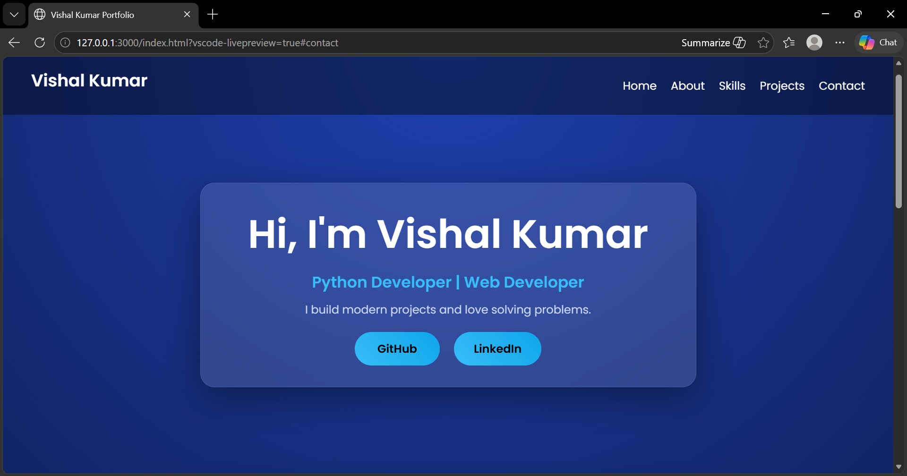
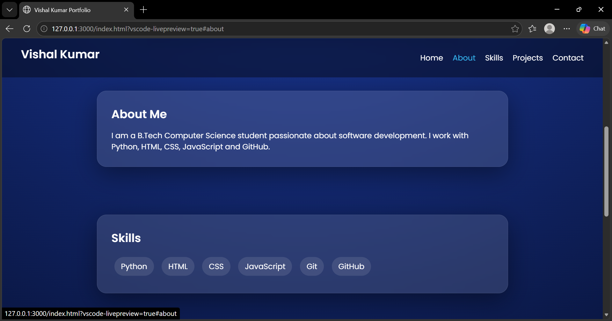
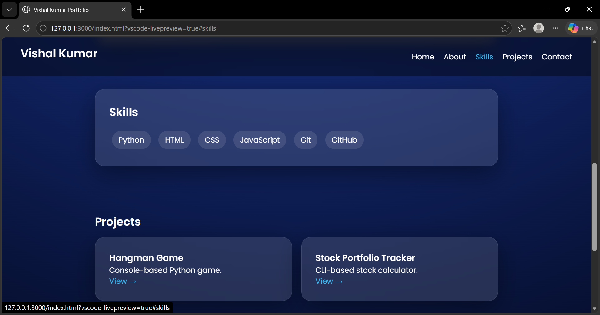

# 💼 Vishal Kumar - Portfolio

🚀 Live Website: https://yourusername.github.io/portfolio/

## 👨‍💻 About Me
I am a B.Tech Computer Science student passionate about software development.  
I have experience in Python, HTML, CSS, JavaScript, and GitHub.

## 🛠️ Skills
- Python
- HTML
- CSS
- JavaScript
- Git & GitHub

## 📂 Projects

### 🎮 Hangman Game
- Console-based Python game
- Random word selection
- Input validation

🔗 GitHub: https://github.com/Vishalkr113/CodeAlpha_Hangman_Game

---

### 📊 Stock Portfolio Tracker
- CLI-based project
- Calculates stock investment

🔗 GitHub: https://github.com/Vishalkr113/CodeAlpha_stock-portfolio-tracker

---

## 📸 Screenshots

## 📬 Contact
- Email: kv574156@gmail.com
- LinkedIn: https://linkedin.com/in/vishal-kumar-b503312a2
- GitHub: https://github.com/Vishalkr113

---

⭐ If you like my work, give a star!